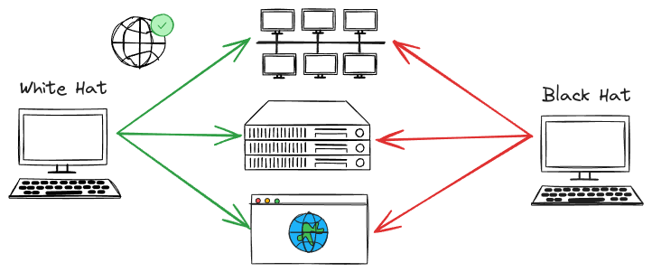

# Ethical Hacking

This repository is a resource for learning ethical hacking, complete with documentation, source code, and practical exercises. Perfect for hands-on security practice! 🔒💻

## What is Ethical Hacking?

A _white hat hacker_ uses their skills to identify and fix security vulnerabilities ethically, while a _black hat hacker_ exploits vulnerabilities for malicious purposes or personal gain.

