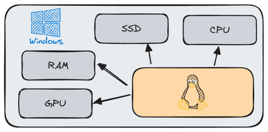
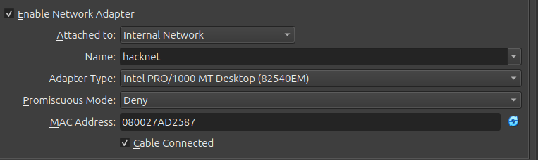

# Setting Up a Hacking Lab

## Virtual Machine & Kali Linux

A **virtual machine** (VM) is a software-based emulation of a computer, running an operating system and applications independently from the host machine. It uses virtualized resources, such as CPU, memory, and storage, allocated by a hypervisor or virtualization software. VMs allow multiple isolated environments on a single physical machine, enabling flexibility and efficient resource utilization.



### Why Choose Linux for Hacking

Linux is an **Open-Source Operating System**, freely available for download and use. Its open nature allows users to modify, copy, and distribute various parts of the OS to suit specific needs. Known for its efficiency, Linux runs smoothly on minimal hardware resources, making it a lightweight yet powerful choice for hacking and cybersecurity tasks. Additionally, a wide range of Linux distributions (distros) exist, each tailored to different types of operations, from general security analysis to penetration testing and beyond.

**Why Kali Linux?** [Kali Linux](https://www.kali.org/) is a specialized distribution designed specifically for penetration testing and security analysis. Preloaded with a comprehensive suite of tools, it’s favored by cybersecurity professionals and ethical hackers worldwide for its reliability and ease of use in security-related tasks.

## Installing and Configuring Kali Linux

### 1. **Install VirtualBox**

- Download and install VirtualBox from the [official website](https://www.virtualbox.org/).

### 2. **Download Kali Linux Image for VirtualBox**

- Head to the [Kali Linux official website](https://www.kali.org/) and navigate to [Kali Linux for Virtual Machines](https://www.kali.org/get-kali/#kali-virtual-machines).
- Select the VirtualBox-compatible image and download it.

### 3. **Add Kali Linux to Virtual Box**

- Extract the downloaded file and double click the `.vbox` file.
- Follow the prompts to complete the import process.

### 4. **Adjust Network Settings**<br />

#### With Internet Connection

- To connect Kali Linux to the internet, go to the network settings of the Kali Linux VM within VirtualBox.
- Set the network adapter to **Bridged Adapter** to access the host machine's network.
- Start the Kali Linux VM and verify connectivity by pinging external sites, e.g., `ping google.com`, and also try to reach the host machine.

#### Internal Network Only

- For an isolated environment, set up a DHCP server within VirtualBox for a secure internal network.

  1.  **Create a DHCP Server for an Internal Network**

      ```bash
      vboxmanage dhcpserver add --network=hacknet --server-ip=10.38.1.1 \
      --lower-ip=10.38.1.110 --upper-ip=10.38.1.120 \
      --netmask=255.255.255.0 --enable
      ```

  2.  **Assign Internal Network to Kali Linux VM**<br />
      In the Kali Linux VM's network settings, switch the adapter to **Internal Network** and set the network name to the one configured above (e.g., `hacknet`).<br />
      

- The Kali Linux VM should now connect to the specified internal network and receive an IP address from the configured DHCP server.
